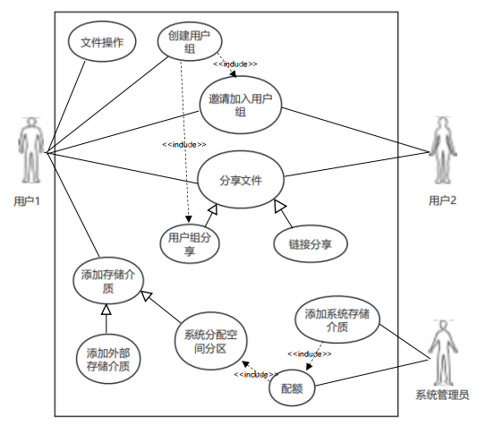
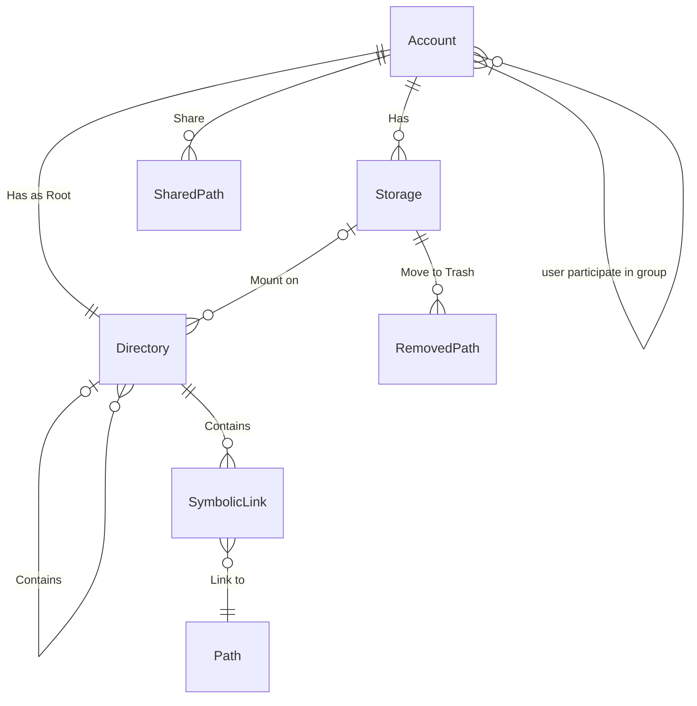
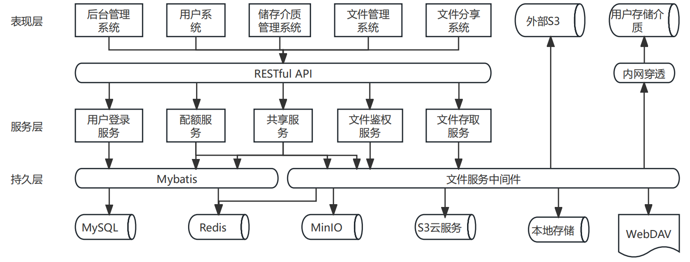
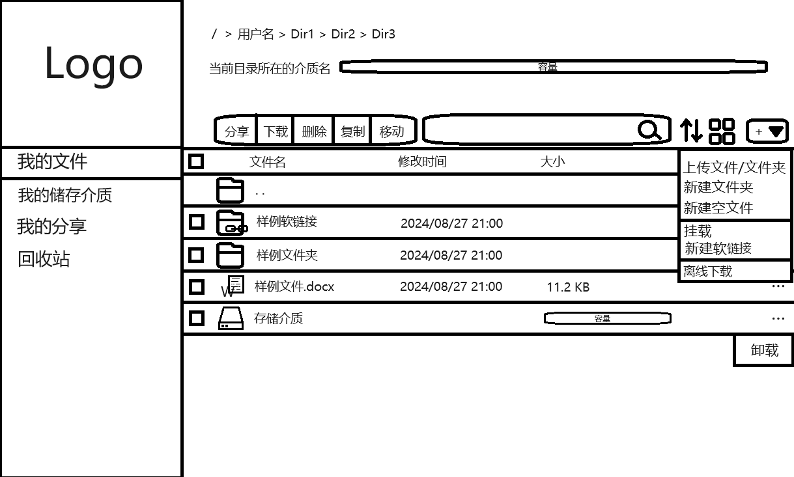
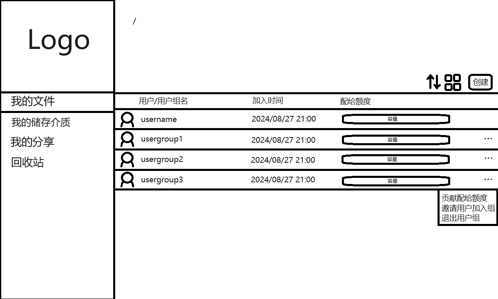
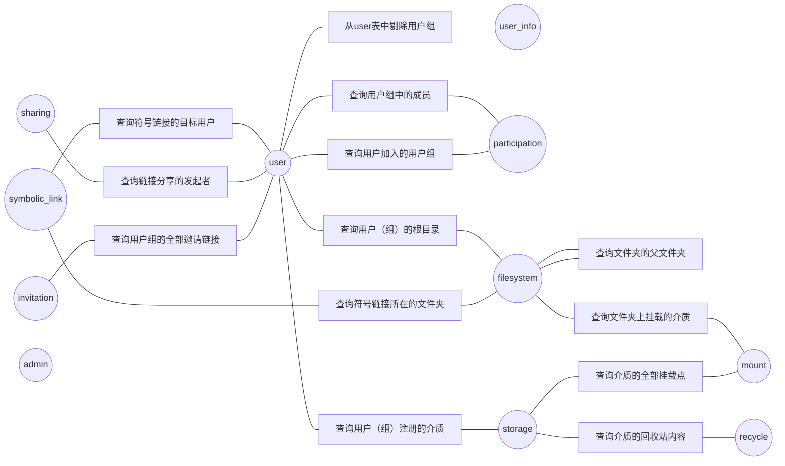

## 目录

[TOC]

## 2.1 项目概述

### 2.1.1 需求说明

#### 2.1.1.1 项目介绍

&emsp;&emsp;共享云盘是互联网存储工具，适用于PC电脑、安卓手机，是互联网云技术的产物，该系统提供了注册、登录、文件上传、文件列表、文件下载、文件分类管理、文件复制与移动、文件夹管理、文件查询功能、文件外链分析、在线预览文件、个人分享列表、回收站等基础功能，另外扩展了用户组和介质管理功能。允许用户创建用户组并邀请其他用户加入，拥有共同权限查看、修改用户组中所加载介质中的文件。介质管理功能中用户可以添加基于S3协议的对象存储服务、基于WebDAV、FTP、SFTP协议的文件传输服务等介质，进行存储文件，并且介质的所属权可以归属用户也可以属于用户组。本项目使用软件开发生产线（`CodeArts`）平台来管理项目的规划、进度跟踪、代码托管、代码检查、编译构建、流水线部署、测试与发布等软件开发全过程，解决需求变动频繁、开发测试环境复杂、多版本分支维护困难、无法有效监控进度和质量等研发痛点。

#### 2.1.1.2 软件项目概述

项目名称：共享云盘

项目开发环境：
- Windows 10/11
- IDE: IntelliJ IDEA 2023.3.4专业版
- Maven: 3.64
- Springboot: 2.6.13
- JDK: 1.8

项目运行环境：
- Ubuntu 22.04
- JRE: 1.8
- 缓存: Redis
- 持久化数据库: MySQL
- 文件系统: MinIO

项目功能：用户注册登录功能、文件上传下载功能、文件/文件夹分类添加移动删除功能、文件查询功能、文件外链分享功能、介质管理功能、回收站功能

用途：共享云盘将传统的本地磁盘存储转移到网上存储，其特点如下：

安全保密：密码和手机绑定、空间访问信息随时告知；

超大存储空间：不限单个文件大小，最多支持无限独享存储空间（视服务器而定）；

好友共享：通过链接提取码轻松分享；

在线预览：无需下载至本地。

介质访问：用户可以将自己的磁盘空间等介质上传到客户端，供其他用户访问。

#### 2.1.1.3 软件功能概述

| 功能 | 优先级 | 负责人 | 描述0 |
|--|--|--|--|
|用户注册|高|杨宏斌（后端）、唐新（前端）|用户通过注册页面能够注册账号|
|用户登陆|高|杨宏斌（后端）、唐新（前端）|用户根据已有账号进行登录|
|用户组创建|高|杨宏斌（后端）、唐新（前端）|每一个用户可以创建多个用户组，用户组拥有一个根目录，可以给用户组内的用户分配存储份额，并且每个用户可以访问用户组目录中存储文件|
|用户加入用户组|高|杨宏斌（后端）、唐新（前端）|用户可以被另一个用户邀请加入用户组|
|文件上传|高|杨宏斌（后端）、唐新（前端）|用户可以将文件上传至当前目录下，支持离线下载功能|
|文件下载|高|杨宏斌（后端）、唐新（前端）|用户可以将当前目录下的文件下载到个人磁盘空间中|
|新建文件夹|高|杨宏斌（后端）、唐新（前端）|用户在当前目录下新建文件夹|
|文件/文件夹重命名|高|杨宏斌（后端）、唐新（前端）|用户可以给文件/文件夹重命名|
|删除文件/文件夹|高|杨宏斌（后端）、唐新（前端）|用户可以删除当前目录下指定文件/文件夹|
|修改文件/文件夹权限|高|夏天（后端）、唐新（前端）|用户能够修改某个用户组文件/文件夹权限，让其他用户|
|外链分享|高|杨宏斌（后端）、唐新（前端）|用户可以分享链接供他人预览、下载文件/文件夹|
|文件查询|中|杨宏斌（后端）、唐新（前端）|用户可以按文件/文件夹名称查找对应文件|
|回收站|中|夏天（后端）、唐新（前端）|用户可以将文件/文件夹放入回收站，保存期限为15天，可以还原/删除回收站中某个文件/文件夹，也可以清空回收站|
|添加介质|高|夏天（后端）、唐新（前端）|用户可以添加WebDAV、SFTP、阿里云OSS等介质放入用户组|
|删除介质|高|夏天（后端）、唐新（前端）|用户可以删除某一介质|
|在线预览图片/txt功能|中|夏天（后端）、唐新（前端）|用户点击预览按钮进行预览图片、文本文件功能|
|在线播放音视频功能|中|夏天（后端）、唐新（前端）|用户点击预览能直接播放音视频|
|在线预览office文档|中|夏天（后端）、唐新（前端）|用户点击预览能直接预览office文档|
|文件分类|低|夏天（后端）、唐新（前端）|用户能够按文件类别名称分类，点击视频、音频、文本文件等按钮可以显示分类后的文件|

#### 2.1.1.4 软件需求分析模型

- 用例图



- ER 图



#### 2.1.1.5 性能要求

&emsp;&emsp;对于非文件传输类请求，系统应在1秒内给出相应，对于文件传输类请求，在系统到客户端、系统到用户存储介质之间的网络通畅可靠的情况下，应保证至少200KB每秒的传输速率。

#### 2.1.1.6 设计约束

1. 开发工具约束：
   - 开发语言：Java（后端）、HTML、CSS、Javascript（前端）
   - 开发软件：IntelliJ IDEA 2023.3.4专业版、vscode 
   - 后端框架：Spring Boot + Spring MVC + MyBatis + MinIO
   - 前端框架：Vue3
2. 运行环境约束：
   - 服务器操作系统：Ubuntu 22.04
   - 客户端：Web网页端 、Electron桌面端、Android移动端
   - 操作系统：Windows 10/11
3. 安全性要求：
   - 用户认证：需要实现用户登录功能，可能涉及权限控制。
   - 安全保密：密码和手机绑定、空间访问信息随时告知；
   - 安全合规性：符合相关法律法规对数据保护的要求。
4. 可靠性要求：
   - 系统稳定性：能够持续稳定运行，具备故障容忍性和备份恢复能力。
   - 超大存储空间：不限单个文件大小，最多支持无限独享存储空间（视服务器而定

#### 2.1.1.7 界面要求

- 在设计上，用户界面应简洁直观，符合用户习惯，易于操作和理解，减少用户学习成本从而提升用户体验。
- 在功能上，各功能模块应明确分组并提供清晰的导航菜单以方便用户快速找到所需要的功能以及切换不同功能页面。
- 在美观上，界面应尽可能使用图片、按钮、选择器等组件并设置合适的样式以实现功能需求和美观需求。

#### 2.1.1.8 交付要求

1. 软件产品交付
   内容：完整的应用软件。
2. 文档交付 
   内容：需求分析文档、系统设计文档、项目思维导图、项目甘特图
3. 源代码交付：
   内容：系统的源代码，包括前端、后端以及数据库代码。
   
### 2.1.2 概要设计

#### 2.1.2.1 体系结构设计



#### 2.1.2.2 功能结构设计


#### 2.1.2.3 用户界面设计






### 2.1.3 数据库设计说明

#### 2.1.3.1 联表查询逻辑设计



#### 2.1.3.2 表汇总

|表名|中文名称|描述|
|---|---|---|
| user | 用户（组）表 | 记录用户和用户组名称的表，合并用户和用户组两个实体是为了方便文件和介质根据所有者联表查询 |
|user_info|用户信息表|记录用户信息，与user联表查询后剩余项保证均为用户|
|participation|用户组加入表|记录用户加入到用户组中的多对多关系|
|storage|存储介质表|记录用户（组）登录到系统的存储介质|
|storage_interface|存储介质接口表|分离storage的接口列以提升索引效率|
|storage_log|挂载日志表|分离storage的日志列以提升索引效率|
|filesystem|外围文件系统表|记录用户（组）挂载区域外的虚拟文件系统结构|
|mount|挂载点表|记录用户（组）在其外围文件系统中挂载介质的位置|
|symbolic_link|符号链接表|记录用户（组）在其外围文件系统中创建符号链接的位置|
|symbolic_link_target_path|符号链接路径表|分离symbolic_link表的path列以提升索引效率|
|recycle|回收站表|记录介质中被移入回收站的文件（夹）|
|recycle_path|回收站路径表|分离recycle表的path列以提升索引效率|
|sharing|链接分享表|记录用户（组）创建的分享链接|
|sharing_path|链接分享路径表|分离sharing表的path列以提升索引效率|
|invitation|邀请链接表|记录用户组加入邀请链接|
|admin|超级管理员表|记录超级管理员登录账户|

#### 2.1.3.3 表设计

- 用户（组）表（user）

|列名|类型|约束|解释|
|---|---|---|---|
|id|BIGINT|PK NOT NULL UNSIGNED AUTO_INCREMENT|主键|
|name|VARCHAR(64)|UNIQUE NOT NULL|用户名或用户组名|
|root| BIGINT | NOT NULL UNSIGNED | 根文件夹主键 |
|create_time|TIMESTAMP|NOT NULL|创建时间|
|update_time|TIMESTAMP|NOT NULL|上次更新时间|
|is_deleted|BOOL|NOT NULL|是否已被注销|

- 用户信息表（user_info）

|列名|类型|约束|解释|
|---|---|---|---|
| id   | BIGINT | PK NOT NULL UNSIGNED AUTO_INCREMENT | 主键 |
| user_id | BIGINT |UNIQUE NOT NULL UNSIGNED|用户主键|
|password|CHAR(64)|NOT NULL|密码（经SHA-256）|
|email|VARCHAR(64)| INDEX(16) |电子邮箱|
|phone_number|VARCHAR(16)| INDEX(8) |手机号码|
|allocated|INT|NOT NULL UNSIGNED|已被分配的存储空间（MB）|
|create_time|TIMESTAMP|NOT NULL|创建时间|
|update_time|TIMESTAMP|NOT NULL|上次更新时间|
|is_deleted|BOOL|NOT NULL|是否已被注销|

- 用户组加入表（participation）

| 列名 | 类型 | 约束 | 解释 |
| ---- | ---- | ---- | ---- |
| id   | BIGINT | PK NOT NULL UNSIGNED AUTO_INCREMENT | 主键 |
| user_id | BIGINT | NOT NULL UNSIGNED UNIQUE(group_id, user_id) | 用户主键 |
|group_id| BIGINT | NOT NULL UNSIGNED UNIQUE(group_id, user_id) | 用户组主键 |
|donated| INT | NOT NULL UNSIGNED | 用户向用户组贡献的容量大小（MB） |
|privilege| INT | NOT NULL UNSIGNED | 权限 |
|create_time|TIMESTAMP|NOT NULL|创建时间|
|update_time|TIMESTAMP|NOT NULL|上次更新时间|
|is_deleted|BOOL|NOT NULL|是否已退出用户组|

- 存储介质表（storage）

| 列名 | 类型 | 约束 | 解释 |
| ---- | ---- | ---- | ---- |
| id   | BIGINT | PK NOT NULL UNSIGNED AUTO_INCREMENT | 主键 |
| owner | BIGINT | NOT NULL UNSIGNED INDEX | 所有者主键 |
| name | VARCHAR(64)|  | 盘符 |
| occupation | INT | NOT NULL UNSIGNED | 介质占用空间（MB）（外部介质为0） |
| readonly | BOOL | NOT NULL | 是否以只读方式挂载 |
|create_time|TIMESTAMP|NOT NULL|创建时间|
|update_time|TIMESTAMP|NOT NULL|上次更新时间|
|is_deleted|BOOL|NOT NULL|是否已删除|

- 存储介质接口表（storage_interface）

| 列名 | 类型 | 约束 | 解释 |
| ---- | ---- | ---- | ---- |
| id   | BIGINT | PK NOT NULL UNSIGNED | 主键，与storage表一一对应 |
| interface | TEXT | NOT NULL | 介质访问接口（JSON格式） |

- 挂载日志表（storage_log）

| 列名 | 类型 | 约束 | 解释 |
| ---- | ---- | ---- | ---- |
| id   | BIGINT | PK NOT NULL UNSIGNED | 主键，与storage表一一对应 |
| update_time | TIMESTAMP | NOT NULL | 最近一次尝试挂载时间 |
| success | BOOL | NOT NULL | 最近一次尝试挂载是否成功 |
| log | TEXT | NOT NULL | 最近一次挂载日志 |

- 外围文件系统表（filesystem）

| 列名 | 类型 | 约束 | 解释 |
| ---- | ---- | ---- | ---- |
| id   | BIGINT | PK NOT NULL UNSIGNED AUTO_INCREMENT | 主键 |
| name | VARCHAR(64)| NOT NULL | 文件夹名 |
|parent|BIGINT|UNSIGNED INDEX|父文件夹id|
|create_time|TIMESTAMP|NOT NULL|创建时间|
|update_time|TIMESTAMP|NOT NULL|上次更新时间|
|is_deleted|BOOL|NOT NULL|是否已删除|

- 挂载点表（mount）

| 列名 | 类型 | 约束 | 解释 |
| ---- | ---- | ---- | ---- |
| id   | BIGINT | PK NOT NULL UNSIGNED AUTO_INCREMENT | 主键 |
| path | BIGINT | UNIQUE NOT NULL UNSIGNED | 挂载外围文件系统位置 |
| storage_id | BIGINT | NOT NULL UNSIGNED | 挂载介质主键 |
|create_time|TIMESTAMP|NOT NULL|创建时间|
|update_time|TIMESTAMP|NOT NULL|上次更新时间|
|is_deleted|BOOL|NOT NULL|是否已删除|

- 符号链接表（symbolic_link）

| 列名 | 类型 | 约束 | 解释 |
| ---- | ---- | ---- | ---- |
| id   | BIGINT | PK NOT NULL UNSIGNED AUTO_INCREMENT | 主键 |
| parent | BIGINT | NOT NULL UNSIGNED INDEX | 符号链接父文件夹主键 |
| name | VARCHAR(64)| NOT NULL | 符号链接名 |
| target_user | BIGINT | NOT NULL UNSIGNED | 目标位置根目录的所有用户（组） |
|create_time|TIMESTAMP|NOT NULL|创建时间|
|update_time|TIMESTAMP|NOT NULL|上次更新时间|
|is_deleted|BOOL|NOT NULL|是否已删除|

- 符号链接路径表（symbolic_link_target_path）

| 列名 | 类型 | 约束 | 解释 |
| ---- | ---- | ---- | ---- |
| id   | BIGINT | PK NOT NULL UNSIGNED | 主键，与symbolic_link表一一对应 |
| path | TEXT | NOT NULL | 目标路径，以"/"分割文件夹名，开头结尾无"/" |

- 回收站表（recycle）

| 列名 | 类型 | 约束 | 解释 |
| ---- | ---- | ---- | ---- |
| id   | BIGINT | PK NOT NULL UNSIGNED AUTO_INCREMENT | 主键 |
|storage_id| BIGINT | NOT NULL UNSIGNED INDEX | 文件（夹）所在存储介质 |
|expire_time|TIMESTAMP|NOT NULL|执行彻底删除时间|
|create_time|TIMESTAMP|NOT NULL|创建时间|
|update_time|TIMESTAMP|NOT NULL|上次更新时间|
|is_deleted|BOOL|NOT NULL|是否已取消（完成删除或被用户恢复）|

- 回收站路径表（recycle_path）

| 列名 | 类型 | 约束 | 解释 |
| ---- | ---- | ---- | ---- |
| id   | BIGINT | PK NOT NULL UNSIGNED | 主键，与recycle表一一对应 |
| path | TEXT | NOT NULL | 目标路径，以"/"分割文件夹名，开头结尾无"/" |

- 链接分享表（sharing）

| 列名 | 类型 | 约束 | 解释 |
| ---- | ---- | ---- | ---- |
| id   | BIGINT | PK NOT NULL UNSIGNED AUTO_INCREMENT | 主键 |
| owner | BIGINT | NOT NULL UNSIGNED INDEX | 所有者主键 |
| link | CHAR(26) | NOT NULL INDEX | 分享链接（只含ULID部分） |
| pwd | CHAR(4) | | 分享口令，为NULL则不存在 |
|expire_time|TIMESTAMP||共享结束时间（NULL表示不过期）|
|create_time|TIMESTAMP|NOT NULL|共享开始时间|
|update_time|TIMESTAMP|NOT NULL|上次更新时间|
|is_deleted|BOOL|NOT NULL|是否已取消（过期或用户手动取消）|

- 链接分享路径表（sharing_path）

| 列名 | 类型 | 约束 | 解释 |
| ---- | ---- | ---- | ---- |
| id   | BIGINT | PK NOT NULL UNSIGNED | 主键，与sharing表一一对应 |
| path | TEXT | NOT NULL | 目标路径，以"/"分割文件夹名，开头结尾无"/" |

- 邀请链接表（invitation）

| 列名 | 类型 | 约束 | 解释 |
| ---- | ---- | ---- | ---- |
| id   | BIGINT | PK NOT NULL UNSIGNED AUTO_INCREMENT | 主键 |
| group_id | BIGINT | NOT NULL UNSIGNED INDEX | 用户组主键 |
| link | CHAR(26) | NOT NULL INDEX | 邀请链接（只含ULID部分） |
| pwd | CHAR(8) | | 邀请口令，为NULL则不存在 |
|expire_time|TIMESTAMP||邀请结束时间（NULL表示不过期）|
|create_time|TIMESTAMP|NOT NULL|邀请开始时间|
|update_time|TIMESTAMP|NOT NULL|上次更新时间|
|is_deleted|BOOL|NOT NULL|是否已取消（过期或用户手动取消）|

- 超级管理员表（admin）

| 列名 | 类型 | 约束 | 解释 |
| ---- | ---- | ---- | ---- |
| id   | BIGINT | PK NOT NULL UNSIGNED AUTO_INCREMENT | 主键 |
| account | VARCHAR(16) | UNIQUE NOT NULL | 管理员登录名 |
| password | CHAR(64) | NOT NULL | 密码（经SHA-256） |
|create_time|TIMESTAMP|NOT NULL|创建时间|
|update_time|TIMESTAMP|NOT NULL|上次更新时间|
|is_deleted|BOOL|NOT NULL|是否已被删除|

### 2.1.4 详细设计

#### 2.1.4.1 服务汇总

|No.|名称|业务范围|输入|输出|描述|
|--|--|---|--|--|--|
|1|邮箱验证码发送|身份验证|邮箱|成功与否|以电子邮件形式发送验证码以验证用户身份|
|2|邮箱验证码验证|身份验证|邮箱+验证码|正确与否|验证用户提供的电子邮件验证码是否正确|
|3|短信验证码发送|身份验证|手机号|成功语法|以短信形式发送验证码以验证用户身份|
|4|短信验证码验证|身份验证|手机号+验证码|正确与否|验证用户提供的短信验证码是否正确|
|5|用户登录|身份验证|(用户名\|手机号\|邮箱)+密码|链接Session|验证用户身份并返回临时登录令牌|
|6|用户注册|用户信息变更|用户名+(手机号\|邮箱)+密码|用户DAO|创建新用户|
|7|创建用户组|用户信息变更|用户DAO+用户组名|用户组DAO|创建新用户组|
|8||||||
|9||||||

#### 2.1.4.2 服务设计

1. 邮箱验证码发送

   ```mermaid
   graph TD
       S("开始")-->A["生成随机6位验证码"]-->B["存(邮箱: 验证码)进Redis"]-->C["调用邮件发送API发送验证邮件"]-->E("结束")
   ```

2. 邮箱验证码验证

   ```mermaid
   graph TD
       S("开始")-->A(["检查Redis中是否存在(邮箱: 验证码)"])
       A--是-->E1("返回true")
       A--否-->E2("返回false")
   ```

3. 短信验证码发送（同1，略）

4. 短信验证码验证（同2，略）

5. 用户登录

   ```mermaid
   graph TD
       S("开始")-->A(["检查user中是否存在指定用户且密码正确"])
       A--是-->B["生成Session"]-->C["将Session存入Redis"]-->E1("返回Session")
       A--否-->E2("返回登录失败")
   ```

6. 用户注册

   ```mermaid
   graph TD
       S("开始")-->A["在filesystem中插入新项"]-->B["在user中插入新项，设root=filesystem新项主键"]-->C["在user_info中插入新项，设user_id=user新项主键"]-->E("结束")
   ```

7. 创建用户组

   ```mermaid
   graph TD
       S("开始")-->A["在filesystem中插入新项"]-->B["在user中插入新项，设root=filesystem新项主键"]-->C["在participation中插入新项，设user_id=用户ID，group_id=user新项主键"]-->E("结束")
   ```

#### 2.1.4.3 API汇总


#### 2.1.4.4 API设计